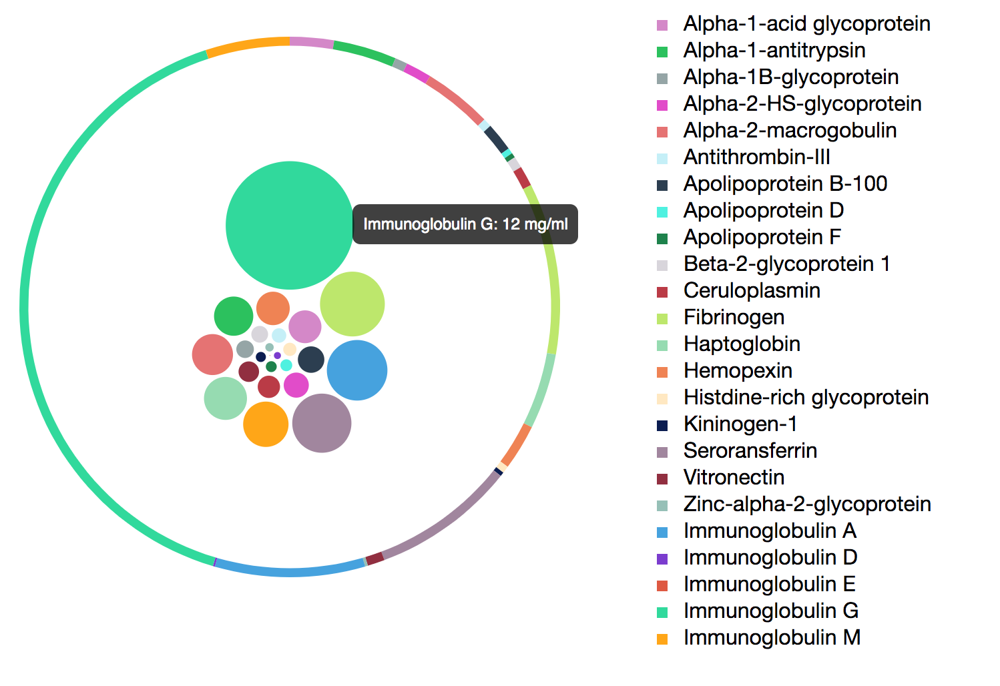

# Glyco-balls
Glyco-balls to display concentration of glycoproteins in blood. Original concept was from StackOverflow: (https://stackoverflow.com/questions/39153035/d3-dougnut-bubble-pie-chart)

# Example:

